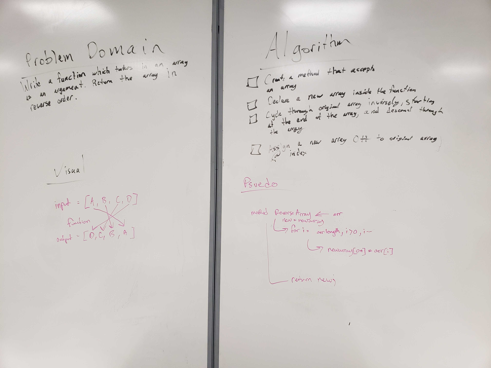
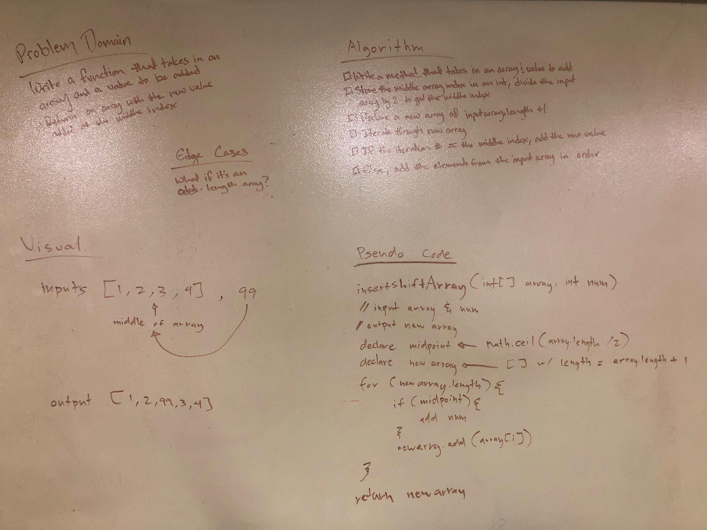
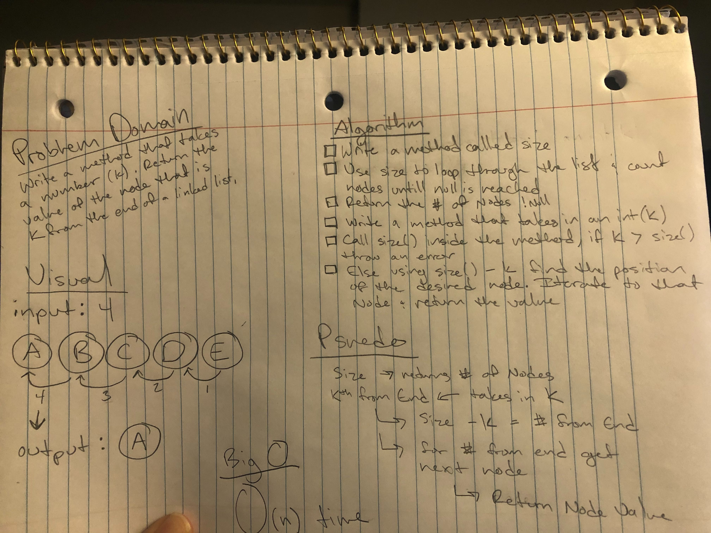
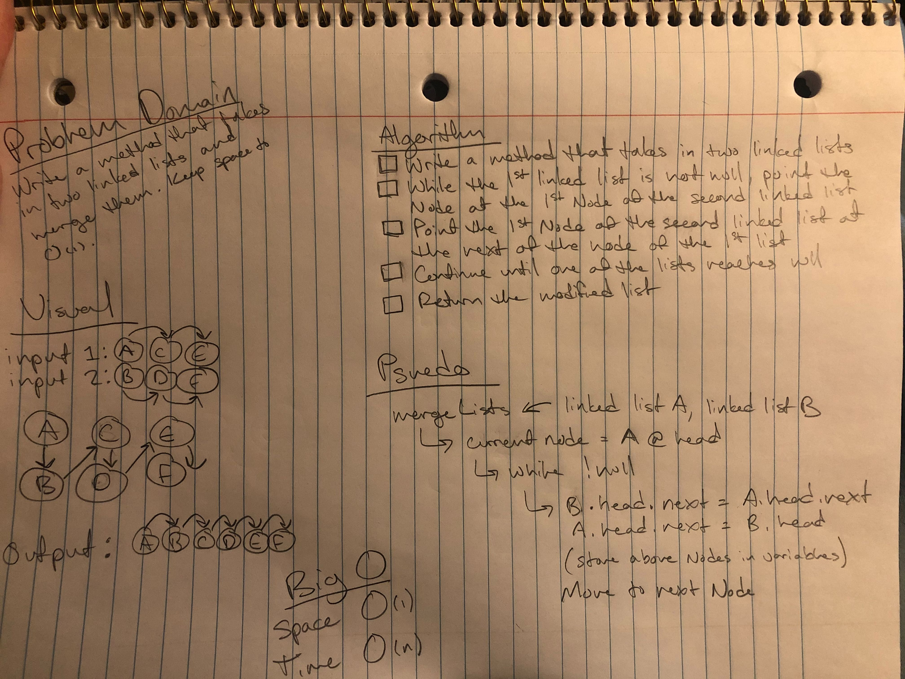
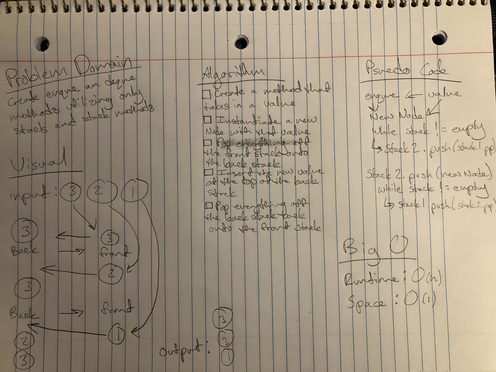
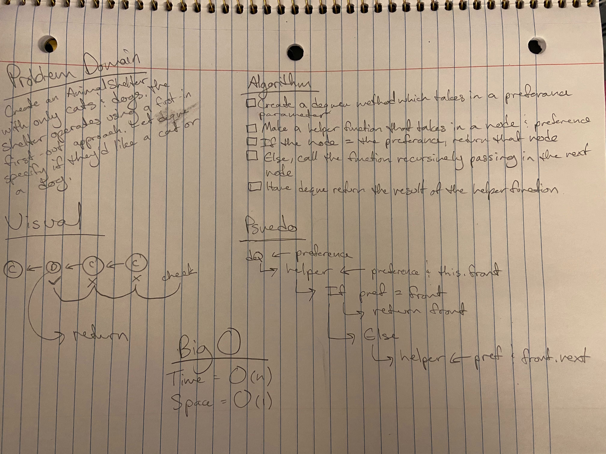
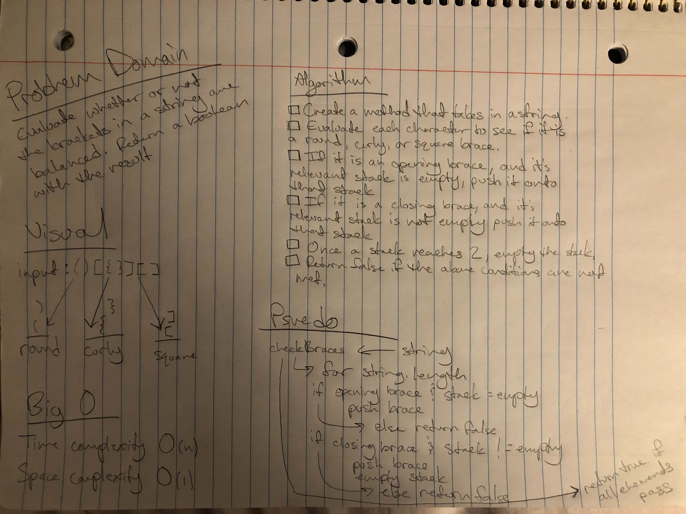
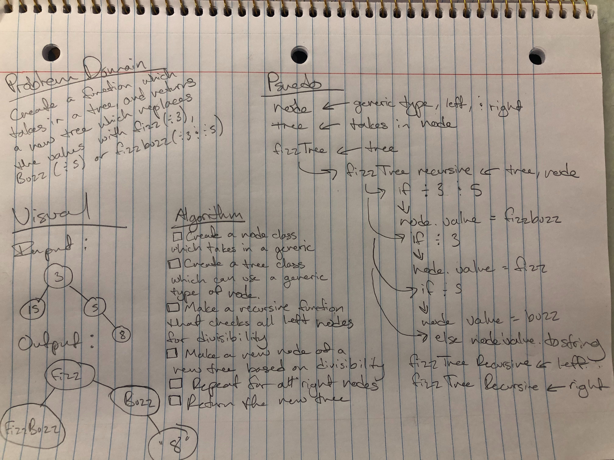
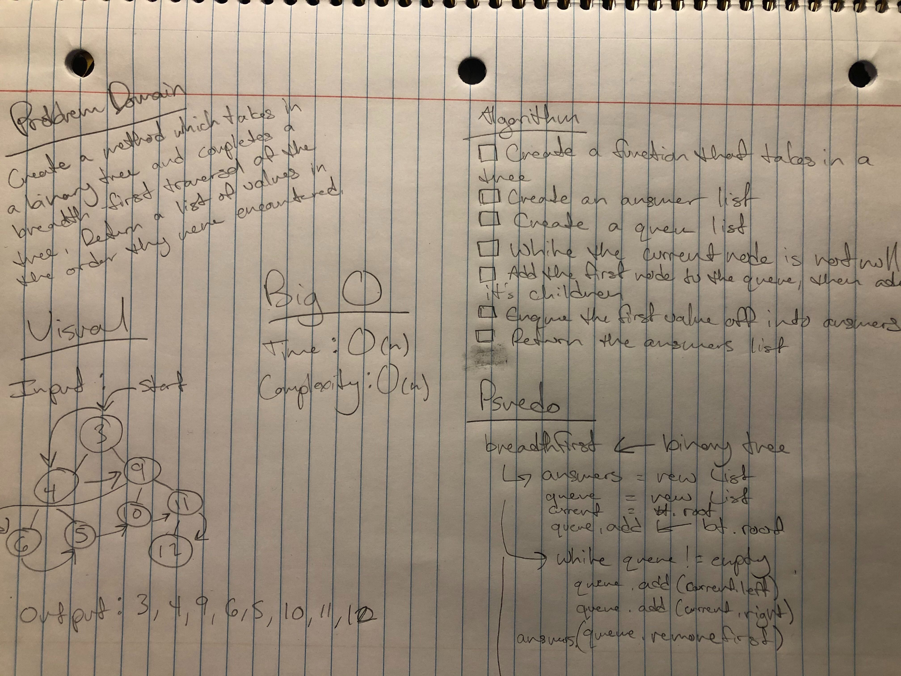
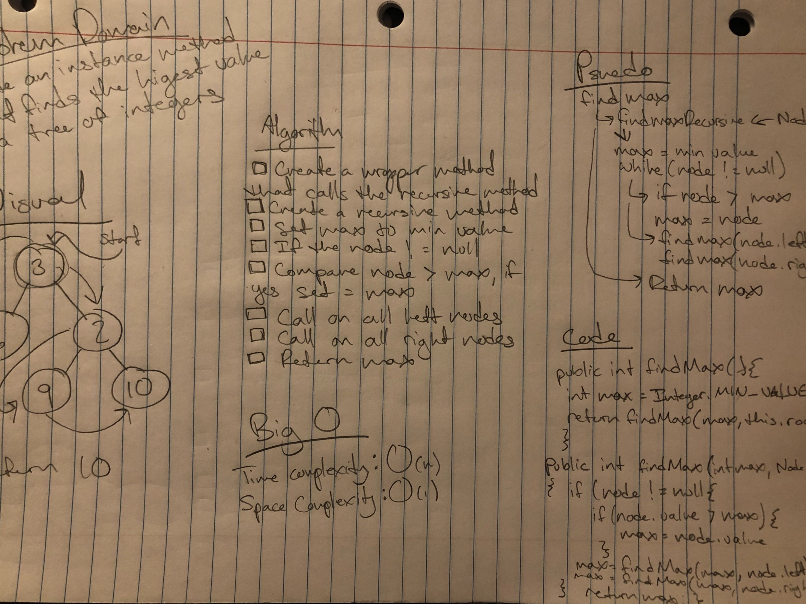

# data-structures-and-algorithms

## Challenge 01
The problem domain for this challenge was to create a method which takes in an array and reverses it.

## Approach & Efficiency
I decided to create a new array instead of modifying the existing one.

## Solution
I used a for loop to iteratie over the input array in reverse, and assign each value to an index in a new array.

## Challenge 02
The problem domain for this challenge was to create a method which takes in an array and a value which should be added to the middle of the array. 

## Approach & Efficiency
Since arrays are fixed-length this requires declaring a new array and assigning it the values of the input array + the input value. I used a for loop to achieve this.

## Solution
I decided to find the midpoint by dividing the input array in half and storing it in an int to remove any decimals. Then I declared a new array with a length +1 of the input array. I iterated over the new array and inside the for loop created an if statement to test if the iteration was before, equal to, or after the midpoint, which determined how I would assign values to each index of the new array.

## Challenge 03
The problem domain for this challenge was to create a method which takes in a sorted array and a search key, and perform a binary search on the array to find the index of the search key, returning -1 if the search key is not found.

## Approach & Efficiency
A binary search is O(log n) time efficiency. In order to perform the binary search I needed to create an if statement that would change my search field, depending on if the compared character was higher or lower than my search key. 

## Solution
Inside a while loop, I found the middle of my search range by dividing the length of the array-1 by 2. I shrank my range by 1 if the compared charater did not match my search key, and then compared my search key to the character in the middle of that new range. If the key was not found by the time the search range reached 0, -1 would be returned.

[See Code Here](https://github.com/Rachnicrice/data-structures-and-algorithms/blob/array-binary-search/code401challenges/src/main/java/code401challenges/BinarySearch.java)

# Singly Linked List
The following code challenges all use singly-linked lists (where the current Node points to the next Node in the sequence or null if no following Node exists).

## Challenge 04
The problem domain for this challenge was to create a singly-linked list, which you could insert to with a O(1) runtime, and which contained methods to check the list for a value, and print the values of the nodes included in the linked list in a string.

## Approach & Efficiency
In order to achieve a O(1) run time for insertion, I had to insert the new Node at the head of the linked list. To do this I made the new Node point at the current head Node, and then replaced the head Node with the new Node.

## API
The LinkedList class currently has the following public methods:
 - insert
  - Takes in a string and instantiates a new Node, then inserts the new Node at the head of the linked list.
 - includes
  - Takes in a string search key and iterates through the linked list until the search key is found, or returns false if the search key is not found by the end of the linked list.
 - toString
  - Takes in no parameters, iterates through the linked list and concatenates the values in a string. At the end of the list returns the string with all the values.
  
[See Code Here](https://github.com/Rachnicrice/data-structures-and-algorithms/blob/master/code401challenges/src/main/java/code401challenges/LinkedList/LinkedList.java)

## Challenge 05
The problem domain for this challenge was to create methods that could insert a new Node before or after a Node with the given search value.

## Approach & Efficiency
Unfortunately because you have to iterate through the linked list until you find the search value that makes the before and after insert methods an O(n) run time.

## API
The LinkedList class currently has the following public methods:
 - append
  - Takes in a string and instantiates a new Node, then appends the new Node to the end of the linked list.
 - insertBefore
  - Takes in a string new value and search key and iterates through the linked list until the search key is found, then creates a new Node with the new value and makes the previous Node point to the new Node and the new Node points to the Node with the search key.
 - insertAfter
  - Takes in a string new value and search key and iterates through the linked list until the search key is found, then creates a new Node with the new value and makes the current Node point to the new Node, and the new Node point to the current Node.next.
 
[See Code Here](https://github.com/Rachnicrice/data-structures-and-algorithms/blob/master/code401challenges/src/main/java/code401challenges/LinkedList/LinkedList.java)

## Challenge 06
The problem domain for this challenge was to create a method that took in a number (k) and returned the value of the Node kth from the end of the linked list.

## Approach & Efficiency
Because signly linked lists only point to the next node in the list there is unfortunately no way to loop backwards. Because of this it is an O(n) efficiency.

## API
The LinkedList class currently has the following public methods:
 - llKthFromEnd
  - Takes in an int(k) and returns the value of the Node that number(k) from the end of the linked list.
 
 
[See Code Here](https://github.com/Rachnicrice/data-structures-and-algorithms/blob/master/code401challenges/src/main/java/code401challenges/LinkedList/LinkedList.java)

## Challenge 07
The problem domain for this challenge was to create a method that took in two linked lists and merged them together, returning the head node of the newly merged list.

## Approach & Efficiency
Because I had to loop through each of the values in the list in order to make re-point the nodes of the two singly-linked lists, my solution has an O(n) runtime. However since I did not allocate any memory to making a new list it has O(1) space complexity.

## API
The LinkedList class currently has the following public methods:
 - mergeList
  - Takes in two linked lists as parameters, repoints the Nodes to join the lists together and returns a reference to the head Node.
 
 
[See Code Here](https://github.com/Rachnicrice/data-structures-and-algorithms/blob/master/code401challenges/src/main/java/code401challenges/LinkedList/LinkedList.java)

# Stacks and Queues
The following code challenges all use stacks and queues.

## Challenge 08
The problem domain for this challenge was to create pop/push methods on a stack and enqueue/dequeue methods on a queue that inserted or removed an element with an O(1) run time.

## Approach & Efficiency
In order to achieve a O(1) run time I did not loop through any of the data structures, for a stack I simply repointed the top value when a node was pushed or popped, and for the queue after the first insertion (for which I had to point the front value) I either repointed the back value (enqueue) or repointed the front value (dequeue).

## API
The Stack class currently has the following public methods:
 - push
  - Takes in a string and instantiates a new Node, then inserts the new Node at the top of the stack.
 - pop
  - Takes in no parameters, removes the top Node from the stack and repoints the top to the next Node in the stack.
 - peek
  - Takes in no parameters, returns the value of the top node in the stack.
 - isEmpty
  - Takes in no parameters, returns true is the stack is empty and false if it is not.
  
  The Queue class currently has the following public methods:
 - enqueue
  - Takes in a string and instantiates a new Node, then inserts the new Node at the back of the queue.
 - dequeue
  - Takes in no parameters, removes the front Node from the stack and repoints the front to the next Node in the queue.
 - peek
  - Takes in no parameters, returns the value of the front node in the queue.
 - isEmpty
  - Takes in no parameters, returns true is the queue is empty and false if it is not.
  
[See Code Here](https://github.com/Rachnicrice/data-structures-and-algorithms/tree/master/code401challenges/src/main/java/code401challenges/stacksAndQueues)

## Challenge 09
The problem domain for this challenge was to create a queue that uses stack objects to enqueue and dequeue.

## Approach & Efficiency
In order to maintain a node at the top of the stack (so that the node would remain at the 'front' of the queue, I had to flip all the stack values onto a different stack and then back. This method of enqueue is a O(n) runtime. The dequeue method stayed much the same, since the work of keeping that nodes in order is done by the enqueue function, I only had to repoint the top Node of the front stack in the queue to the next node in the stack. The dequeue method remains an O(1) runtime.

## API
The PseudoQueue class currently has the following public methods:
 - enqueue
  - Takes in a string as a parameter. It will flip pop all the values off the front stack and push them onto the back stack. After that has completed it will push the string value onto the back stack, and then pop all the values off the back stack and push them back onto the front stack.
 - dequeue
  - Takes in no parameters, removes the top Node from the stack and repoints the top to the next Node in the stack. Returns the value of the top Node.
  
[See Code Here](https://github.com/Rachnicrice/data-structures-and-algorithms/tree/master/code401challenges/src/main/java/code401challenges/stacksAndQueues)

## Challenge 10
The problem domain for this challenge was to create a queue for an Animal Shelter, with enqueue and dequeue methods that allow the 'adopter' to specify which kind of animal they want to adopt from the shelter.

## Approach & Efficiency
In order to be able to not just return the first value in my queue but also be able to return the first animal that matched the specified type, I made my enqueue function recursive. It will check the first node in the queue, and if it doesn not match the specified type it will call itself again until the end of the queue is reached or a matching 'animal' is found.

## API
The AnimalShelter class currently has the following public methods:
 - enqueue
  - Takes in a string as a parameter. It will instantiate a new Animal and add it to the back of the queue.
 - dequeue
  - Takes in a string as a parameter, it will search the queue front to back until it finds the first value that matches the search parameter and return that value. It will repoint the node before to the node following the 'found' node.
  
[See Code Here](https://github.com/Rachnicrice/data-structures-and-algorithms/tree/master/code401challenges/src/main/java/code401challenges/utilities)

## Challenge 11
The problem domain for this challenge was to create a method that evaluated whether or not the brackets in a string input were balanced. Ex. () is balanced, {, [), and ({)} are not.

## Approach & Efficiency
I decided to loop through the string and evaluate each character individually. To do this I created three empty stacks for each type of brackets. If the character was an opening brace, I would check to make sure it's relevant stack was empty and then push it into that stack. When I found an closing brace, I would check to make sure it's relevant stack was not empty, and pop the value off. If by the end of the String all the stacks were still empty, then I would return true, if not then return false.

## API
- multiBracketValidation
  
[See Code Here](https://github.com/Rachnicrice/data-structures-and-algorithms/tree/master/code401challenges/src/main/java/code401challenges/utilities)

# Binary Tree and BST
The following code challenges all use binary trees and binary search trees.

## Challenge 12
The problem domain for this challenge was to create a binary tree and binary search tree. The binary tree includes a preOrder, inOrder and postOrder traversal methods. The binary search tree (BST) includes an add and contains method.

## Approach & Efficiency
I decided to approach each of these methods recursively. The contains method has an O(log n) runtime, all other methods have an O(n) runtime.

## API
The Tree class currently has the following public methods:
 - preOrder
  - Returns an array of the values in the binary search tree ordered from self (referring to the current Node) to left to right.
 - inOrder
  - Returns an array of the values in the binary search tree ordered from left to self (referring to the current Node) to right.
 - postOrder
  - Returns an array of the values in the binary search tree ordered from left to right to self (referring to the current Node).
  
The BST class currently has the following public methods:
 - add
  - Takes in a int value and instantiates a new Node, then does a recursive call to find where it belongs in the tree by checking to see if it is larger or smaller than the current node.
 - contains
  - Takes in a int value, then does a recursive call to find the value if it exists in the tree. Will return true if the value is found, false if not.
  
[See Code Here](https://github.com/Rachnicrice/data-structures-and-algorithms/tree/master/code401challenges/src/main/java/code401challenges/tree)

## Challenge 13
The problem domain for this challenge was to create a method that took in a tree and returned a new tree where the values were replaced with Fizz, Buzz or FizzBuzz dependant on whether the number was divisible by 3, 5, or both.

## Approach & Efficiency
This function is going to have an O(n) runtime because it will need to check each node in the input tree. Unfortunately there is no way around this. I made a recursive call that preformed the check on each of the input tree's nodes before creating a corresponding node on the new FizzBuzzTree.

## API
- makeFizzBuzzTree
  - takes in a tree and, instantiaes a new FizzBuzzTree and makes a recursive call to fizzBuzzTree. Returns the FizzBuzzTree.
- fizzBuzzTree
  - takes in a tree, it's node, a FizzBuzzTree, and it's node. Then checks the tree to see what the value is divisible by, makes a new node on the FizzBuzzTree and sets it's node to the corresponding value. Calls all left nodes and right nodes on the tree.
  
[See Code Here](https://github.com/Rachnicrice/data-structures-and-algorithms/tree/master/code401challenges/src/main/java/code401challenges/utilities/FizzBuzzTree)

## Challenge 14
The problem domain for this challenge was to create a method that took in a tree and preformed a breadth-first traversal, returning the values of the nodes in the tree in the order in which they were encountered.

## Approach & Efficiency
This function is going to have an O(n) runtime because it will need to check each node in the input tree. Unfortunately there is no way around this. I used a queue to store the current node, add it's left and right children, then pop the current node off the queue and push it's value into my answers queue. The current node then because whichever node was at the front of the queue and the process was repeated until the queue was empty.

## API
- breadth first
  - takes in a tree and, instantiaes a new queue list and answers list. Add the root node to the front of the queue, then in a loop that will run while the queue is not empty, add the left and right children of the front node to the back of the queue, remove the front node and add it to the answers list, set the new front node to be the next node in the queue. At the end of the loop, return the answers list.
  
[See Code Here](https://github.com/Rachnicrice/data-structures-and-algorithms/blob/master/code401challenges/src/main/java/code401challenges/tree/Tree.java)

## Challenge 15
The problem domain for this challenge was to create an instance method that found the maximum value present on a binary tree.

## Approach & Efficiency
This function is going to have an O(n) runtime because it will need to check each node in the input tree. However it does have an O(1) time complexity since I am only returning one value.

## API
- find_Maximum_Value
  - the wrapper method takes in no parameters. It checks to see if the root is not null, if it is not, then it will instantiate a int called max to be the minimum possible value and call the recursive method.
- find_Maximum_Value
  - the recursive method takes in the max value and a node. It will check that the node is not null, if it is not it will check to see if the node's value is greater than max. If the node's value is greater, max will be set to equal the node value. Then max gets the recursive call passing in the new max and the node.left and node.right. Once all the recusive calls have been made max is returned.
  
[See Code Here](https://github.com/Rachnicrice/data-structures-and-algorithms/blob/master/code401challenges/src/main/java/code401challenges/tree/Tree.java)

