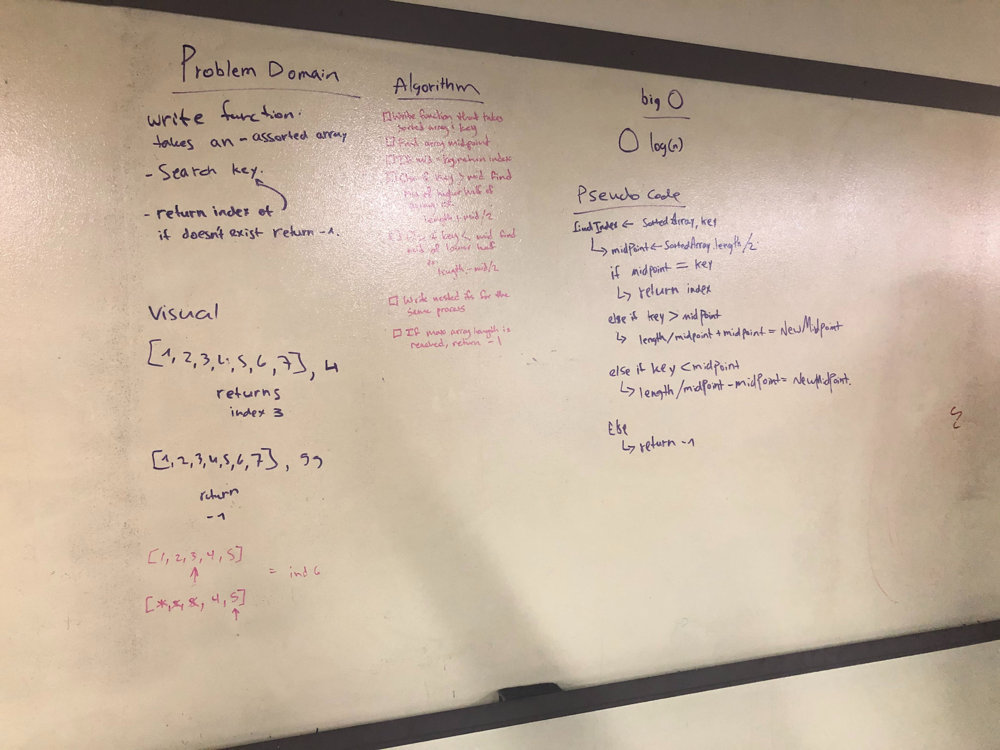

# data-structures-and-algorithms

## Challenge 01
The problem domain for this challenge was to create a method which takes in an array and reverses it.

## Approach & Efficiency
I decided to create a new array instead of modifying the existing one.

## Solution
I used a for loop to iteratie over the input array in reverse, and assign each value to an index in a new array.

## Challenge 02
The problem domain for this challenge was to create a method which takes in an array and a value which should be added to the middle of the array. 

## Approach & Efficiency
Since arrays are fixed-length this requires declaring a new array and assigning it the values of the input array + the input value. I used a for loop to achieve this.

## Solution
I decided to find the midpoint by dividing the input array in half and storing it in an int to remove any decimals. Then I declared a new array with a length +1 of the input array. I iterated over the new array and inside the for loop created an if statement to test if the iteration was before, equal to, or after the midpoint, which determined how I would assign values to each index of the new array.

## Challenge 03
The problem domain for this challenge was to create a method which takes in a sorted array and a search key, and perform a binary search on the array to find the index of the search key, returning -1 if the search key is not found.

## Approach & Efficiency
A binary search is O(log n) time efficiency. In order to perform the binary search I needed to create an if statement that would change my search field, depending on if the compared character was higher or lower than my search key. 

## Solution
Inside a while loop, I found the middle of my search range by dividing the length of the array-1 by 2. I shrank my range by 1 if the compared charater did not match my search key, and then compared my search key to the character in the middle of that new range. If the key was not found by the time the search range reached 0, -1 would be returned.

[See Code Here](https://github.com/Rachnicrice/data-structures-and-algorithms/blob/array-binary-search/code401challenges/src/main/java/code401challenges/BinarySearch.java)

# Singly Linked List
The following code challenges all use singly-linked lists (where the current Node points to the next Node in the sequence or null if no following Node exists).

## Challenge 04
The problem domain for this challenge was to create a singly-linked list, which you could insert to with a O(1) runtime, and which contained methods to check the list for a value, and print the values of the nodes included in the linked list in a string.

## Approach & Efficiency
In order to achieve a O(1) run time for insertion, I had to insert the new Node at the head of the linked list. To do this I made the new Node point at the current head Node, and then replaced the head Node with the new Node.

## API
The LinkedList class currently has the following public methods:
 - insert
  - Takes in a string and instantiates a new Node, then inserts the new Node at the head of the linked list.
 - includes
  - Takes in a string search key and iterates through the linked list until the search key is found, or returns false if the search key is not found by the end of the linked list.
 - toString
  - Takes in no parameters, iterates through the linked list and concatenates the values in a string. At the end of the list returns the string with all the values.
  
[See Code Here](https://github.com/Rachnicrice/data-structures-and-algorithms/blob/master/code401challenges/src/main/java/code401challenges/LinkedList/LinkedList.java)

## Challenge 05
The problem domain for this challenge was to create methods that could insert a new Node before or after a Node with the given search value.

## Approach & Efficiency
Unfortunately because you have to iterate through the linked list until you find the search value that makes the before and after insert methods an O(n) run time.

## API
The LinkedList class currently has the following public methods:
 - append
  - Takes in a string and instantiates a new Node, then appends the new Node to the end of the linked list.
 - insertBefore
  - Takes in a string new value and search key and iterates through the linked list until the search key is found, then creates a new Node with the new value and makes the previous Node point to the new Node and the new Node points to the Node with the search key.
 - insertAfter
  - Takes in a string new value and search key and iterates through the linked list until the search key is found, then creates a new Node with the new value and makes the current Node point to the new Node, and the new Node point to the current Node.next.
 
[See Code Here](https://github.com/Rachnicrice/data-structures-and-algorithms/blob/master/code401challenges/src/main/java/code401challenges/LinkedList/LinkedList.java)

## Challenge 05
The problem domain for this challenge was to create a method that took in a number (k) and returned the value of the Node kth from the end of the linked list.

## Approach & Efficiency
Because signly linked lists only point to the next node in the list there is unfortunately no way to loop backwards.

## API
The LinkedList class currently has the following public methods:
 - llKthFromEnd
  - Takes in an int(k) and returns the value of the Node that number(k) from the end of the linked list.
 
 
[See Code Here](https://github.com/Rachnicrice/data-structures-and-algorithms/blob/master/code401challenges/src/main/java/code401challenges/LinkedList/LinkedList.java)

