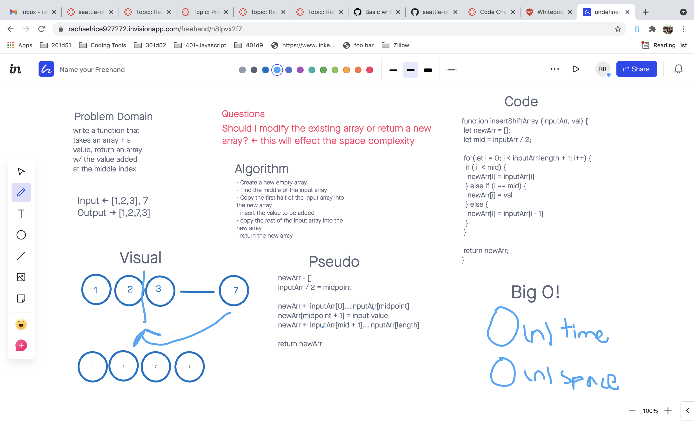

## Challenge 01
The problem domain for this challenge was to create a function which takes an array and a value to be added and return an array with the value added to the middle index.

## Approach & Efficiency
I decided to create a new array instead of modifying the existing one.

## Solution
I first found the midpoint of the input array, then I copied the first half of the input array into my new array. At the midpoint I added the value to my new array, then finally I copied the remainder of the input array.

-------------------------------------------

## Challenge 02
The problem domain for this challenge was to create a method which takes in a sorted array and a search key, and perform a binary search on the array to find the index of the search key, returning -1 if the search key is not found.

## Approach & Efficiency
A binary search is O(log n) time efficiency. In order to perform the binary search I would check the midpoint of the array and then continue searching to the left or right depending on if the value of the midpoint was higher or lower than the search key.

## Solution
Inside a while loop, I found the middle of my search range by dividing the length of the array-1 by 2. I shrank my range by 1 if the middle value did not match the search key. Rinse and repeat, comparing the search key to the character in the middle of each new range. If the key wasn't found by the time the search range reached 0, -1 would be returned. (The search range being the length of my shortened array).

-------------------------------------------------

## Singly Linked List
The problem domain for this challenge was to create a singly-linked list, which you could insert to with a O(1) runtime, and which contained methods to check the list for a value, and print the values of the nodes included in the linked list in a string.

## Approach & Efficiency
In order to achieve a O(1) run time for insertion, I had to insert the new Node at the head of the linked list. To do this I made the new Node point at the current head Node, and then replaced the head Node with the new Node.

## API
The LinkedList class currently has the following public methods:

insert
Takes in a string and instantiates a new Node, then inserts the new Node at the head of the linked list.
includes
Takes in a string search key and iterates through the linked list until the search key is found, or returns false if the search key is not found by the end of the linked list.
toString
Takes in no parameters, iterates through the linked list and concatenates the values in a string. At the end of the list returns the string with all the values.

[See Code Here](./LinkedList/LinkedList.js)
