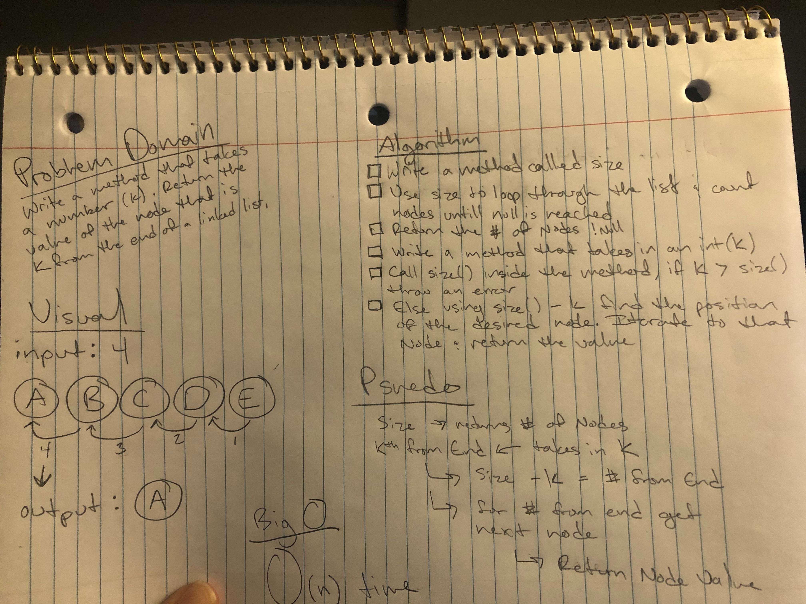
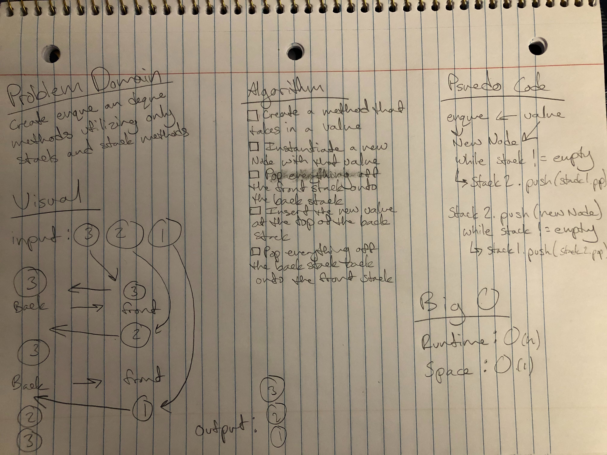

## Challenge 01
The problem domain for this challenge was to create a function which takes an array and a value to be added and return an array with the value added to the middle index.

## Approach & Efficiency
I decided to create a new array instead of modifying the existing one.

## Solution
I first found the midpoint of the input array, then I copied the first half of the input array into my new array. At the midpoint I added the value to my new array, then finally I copied the remainder of the input array.

-------------------------------------------

## Challenge 02
The problem domain for this challenge was to create a method which takes in a sorted array and a search key, and perform a binary search on the array to find the index of the search key, returning -1 if the search key is not found.

## Approach & Efficiency
A binary search is O(log n) time efficiency. In order to perform the binary search I would check the midpoint of the array and then continue searching to the left or right depending on if the value of the midpoint was higher or lower than the search key.

## Solution
Inside a while loop, I found the middle of my search range by dividing the length of the array-1 by 2. I shrank my range by 1 if the middle value did not match the search key. Rinse and repeat, comparing the search key to the character in the middle of each new range. If the key wasn't found by the time the search range reached 0, -1 would be returned. (The search range being the length of my shortened array).

-------------------------------------------------

## Singly Linked List
The problem domain for this challenge was to create a singly-linked list, which you could insert to with a O(1) runtime, and which contained methods to check the list for a value, and print the values of the nodes included in the linked list in a string.

## Approach & Efficiency
In order to achieve a O(1) run time for insertion, I had to insert the new Node at the head of the linked list. To do this I made the new Node point at the current head Node, and then replaced the head Node with the new Node.

## API
The LinkedList class currently has the following public methods:

insert
Takes in a string and instantiates a new Node, then inserts the new Node at the head of the linked list.
includes
Takes in a string search key and iterates through the linked list until the search key is found, or returns false if the search key is not found by the end of the linked list.
toString
Takes in no parameters, iterates through the linked list and concatenates the values in a string. At the end of the list returns the string with all the values.

[See Code Here](./LinkedList/LinkedList.js)
-------------------------------------------------

## Singly Linked List - Additional Methods
The problem domain for this challenge was to create methods that could insert a new Node before or after a Node with the given search value as well as to add an append method.

## Approach & Efficiency
Unfortunately because you have to iterate through the linked list until you find the search value that makes the before and after insert methods an O(n) run time.

## API
The LinkedList class currently has the following public methods:

append - Takes in a string and instantiates a new Node, then appends the new Node to the end of the linked list.
  
insertBefore -  
Takes in a string new value and search key and iterates through the linked list until the search key is found, then creates a new Node with the new value and makes the previous Node point to the new Node and the new Node points to the Node with the search key.
  
insertAfter -  
Takes in a string new value and search key and iterates through the linked list until the search key is found, then creates a new Node with the new value and makes the current Node point to the new Node, and the new Node point to the current Node.next.

[See Code Here](./LinkedList/LinkedList.js)
-----------------------------------------------
## Challenge 06
The problem domain for this challenge was to create a method that took in a number (k) and returned the value of the Node kth from the end of the linked list.

## Approach & Efficiency
Because signly linked lists only point to the next node in the list there is unfortunately no way to loop backwards. Because of this it is an O(n) efficiency.

## API
The LinkedList class currently has the following public methods:
 - llKthFromEnd
  - Takes in an int(k) and returns the value of the Node that number(k) from the end of the linked list.
 

------------------------------------------------
## Stacks and Queues
The following code challenges all use stacks and queues.  
The problem domain for this challenge was to create pop/push methods on a stack and enqueue/dequeue methods on a queue that inserted or removed an element with an O(1) run time.

## Approach & Efficiency
In order to achieve a O(1) run time I did not loop through any of the data structures, for a stack I simply repointed the top value when a node was pushed or popped, and for the queue after the first insertion (for which I had to point the front value) I either repointed the back value (enqueue) or repointed the front value (dequeue).

## API
The Stack class currently has the following public methods:
 - push
  - Takes in a string and instantiates a new Node, then inserts the new Node at the top of the stack.
 - pop
  - Takes in no parameters, removes the top Node from the stack and repoints the top to the next Node in the stack.
 - peek
  - Takes in no parameters, returns the value of the top node in the stack.
 - isEmpty
  - Takes in no parameters, returns true is the stack is empty and false if it is not.
  
  The Queue class currently has the following public methods:
 - enqueue
  - Takes in a string and instantiates a new Node, then inserts the new Node at the back of the queue.
 - dequeue
  - Takes in no parameters, removes the front Node from the stack and repoints the front to the next Node in the queue.
 - peek
  - Takes in no parameters, returns the value of the front node in the queue.
 - isEmpty
  - Takes in no parameters, returns true is the queue is empty and false if it is not.

[See Stack Implementtion Here](./Stacks_Queues/Stack.js)
[See Queue Implementation Here](./Stacks_Queues/Queue.js)
------------------------------------------------------
## Challenge 09
The problem domain for this challenge was to create a queue that uses stack objects to enqueue and dequeue.

## Approach & Efficiency
In order to maintain a node at the top of the stack (so that the node would remain at the 'front' of the queue, I had to flip all the stack values onto a different stack and then back. This method of enqueue is a O(n) runtime. The dequeue method stayed much the same, since the work of keeping that nodes in order is done by the enqueue function, I only had to repoint the top Node of the front stack in the queue to the next node in the stack. The dequeue method remains an O(1) runtime.

## API
The PseudoQueue class currently has the following public methods:
 - enqueue
  - Takes in a string as a parameter. It will flip pop all the values off the front stack and push them onto the back stack. After that has completed it will push the string value onto the back stack, and then pop all the values off the back stack and push them back onto the front stack.
 - dequeue
  - Takes in no parameters, removes the top Node from the stack and repoints the top to the next Node in the stack. Returns the value of the top Node.

